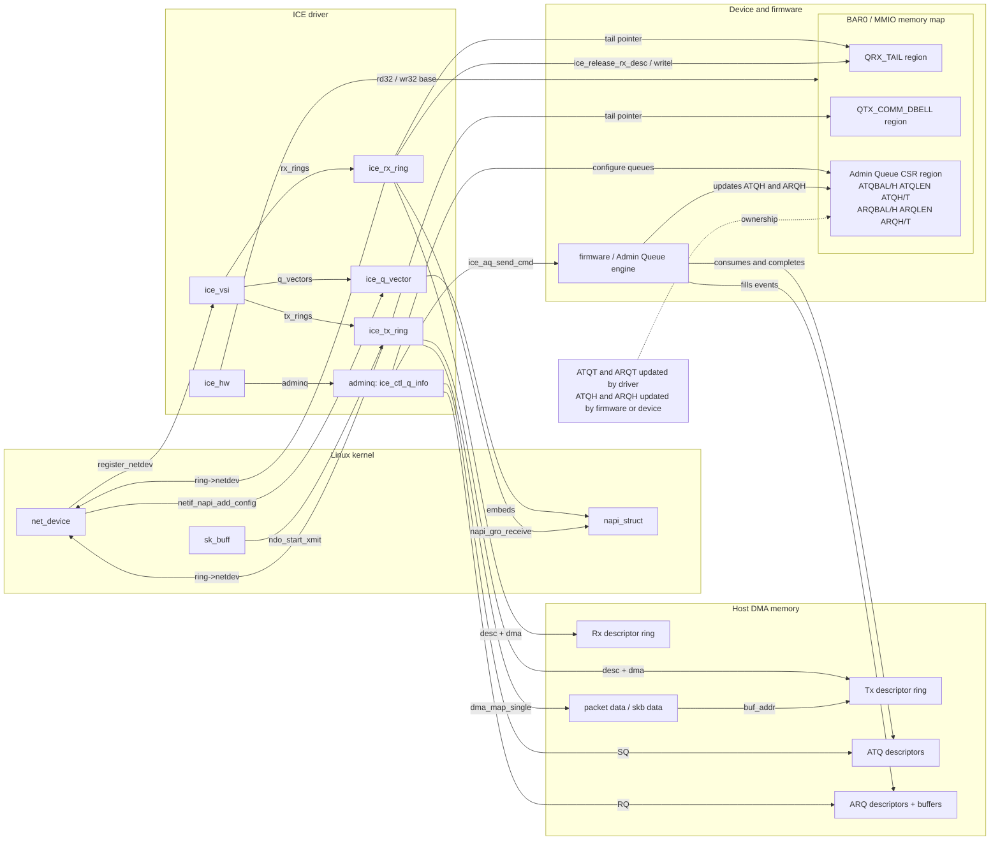
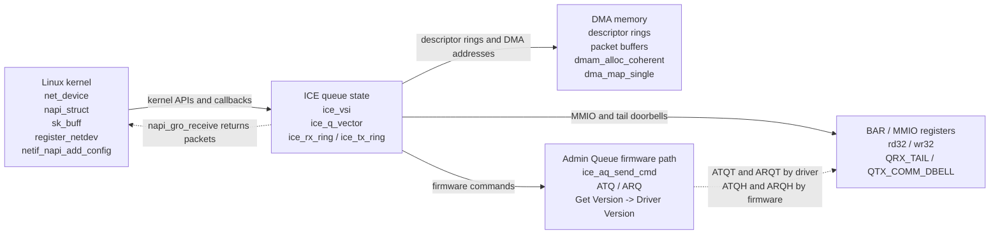

# ICE Kernel/Hardware Diagram Notes

This file gives the minimal text needed to draw an ICE analogue of `docs/ixgbe-dma.svg`, plus a short explanation of each connection.

I could not interpret `docs/ixgbe-dma.pdf` directly in this environment, so this note is based on `docs/ixgbe-dma.svg` and the Linux ICE source.

## What The Existing IXGBE Diagram Is Showing

The IXGBE figure is a compact pointer-and-effects diagram. It does not try to show all control flow. Instead, it shows:

- the main driver structs
- the MMIO BAR mapping
- the descriptor-ring memory
- the packet buffer / DMA address flow
- the specific registers or pointers that connect those pieces

For ICE, the same style should work if we focus on:

- kernel-facing objects: `net_device`, `napi_struct`, `sk_buff`
- driver-owned objects: `ice_vsi`, `ice_q_vector`, `ice_rx_ring`, `ice_tx_ring`, `ice_hw`, `ice_ctl_q_info`
- hardware-facing objects: BAR/MMIO registers, Rx/Tx descriptor rings, Admin Queue rings and buffers

## Minimal Diagram Text

If you want a single figure in the same spirit as `ixgbe-dma.svg`, this is the minimum text I would put into the boxes.

### Box 1: Linux kernel objects

This box is the kernel-facing side of the driver boundary. It represents the objects that Linux uses to invoke the driver, schedule packet processing, and carry packets into or out of the networking stack.

- `net_device` is the top-level interface object registered with the kernel.
- `napi_struct` is the polling context used for receive-side processing.
- `sk_buff` is the packet object exchanged with the rest of the networking stack.

```c
struct net_device
struct napi_struct
struct sk_buff
```

### Box 2: Driver-visible top-level ICE state

This box is the central driver-owned state that connects the kernel to the actual queue machinery. It should be read as the top-level object graph that organizes per-interface, per-vector, and per-queue state.

- `ice_vsi` is the main per-interface object that ties a Linux `net_device` to ICE queue state.
- `ice_q_vector` is the interrupt and polling aggregation object.
- The arrows from this box to other boxes are the key point: this is where the driver links kernel objects, DMA memory, and device-visible queue state together.

ASCII sketch:

```text
                 +----------------+
                 |    ice_vsi     |
                 +----------------+
                  | netdev
                  v
             +------------+
             | net_device |
             +------------+
                  |
      +-----------+-----------+
      |                       |
      v                       v
+--------------+       +--------------+
| ice_rx_ring  |       | ice_tx_ring  |
+--------------+       +--------------+
      ^
      |
+--------------+
| ice_q_vector |
+--------------+
      |
      v
+--------------+
| napi_struct  |
+--------------+
```

```c
struct ice_vsi {
    struct net_device *netdev;
    struct ice_rx_ring **rx_rings;
    struct ice_tx_ring **tx_rings;
    struct ice_q_vector **q_vectors;
}

struct ice_q_vector {
    struct ice_vsi *vsi;
    struct napi_struct napi;
}
```

### Box 3: MMIO/BAR state

This box is the driver's entry point into the device's MMIO address space. It is intentionally small, because the important fact for the figure is not every field in `ice_hw`, but that `hw_addr` gives the base of the BAR-mapped register space and that the hardware object also carries Admin Queue state.

- `hw_addr` means "the driver can reach device registers by indexed reads and writes into this BAR-backed region".
- `adminq` reminds the reader that firmware communication is also anchored in the same hardware-facing state.

ASCII sketch:

```text
+----------------+
|     ice_hw     |
+----------------+
| hw_addr  ------+------------------------------+
| adminq   ----+ |                              |
+--------------|-+                              |
               |                                v
               |                   +--------------------------+
               |                   |     BAR0 / MMIO map      |
               |                   |   register address space |
               |                   +--------------------------+
               |
               v
         +----------------+
         | ice_ctl_q_info |
         +----------------+
```

```c
struct ice_hw {
    u8 __iomem *hw_addr;
    struct ice_ctl_q_info adminq;
}
```

### Box 4: Rx/Tx ring state

This box is the detailed fast-path state. These ring objects are where software pointers, DMA addresses, MMIO tail pointers, and backreferences to kernel state come together.

- `desc` points to descriptor-ring memory shared with hardware.
- `dma` is the DMA-visible address of that ring memory.
- `tail` is the MMIO location used to publish newly available descriptors to the device.
- `q_vector`, `netdev`, and `vsi` show that the rings are not isolated data structures; they are tied back into both interrupt context and kernel-visible interface state.
- `desc` and `dma` are not BAR fields: they refer to host memory used for DMA.
- `tail` is the field in this box that points into the BAR/MMIO region.

ASCII sketch:

```text
+------------------+
|   ice_tx_ring    |
+------------------+
| desc -----------+------> [host descriptor ring memory]
| dma ------------+------> [DMA address of host ring memory]
| tail -----------+------> [BAR tail register]
| q_vector ------>+------> [ice_q_vector]
| netdev -------->+------> [net_device]
| vsi ----------->+------> [ice_vsi]
+------------------+

+------------------+
|   ice_rx_ring    |
+------------------+
| desc -----------+------> [host descriptor ring memory]
| dma ------------+------> [DMA address of host ring memory]
| tail -----------+------> [BAR tail register]
| q_vector ------>+------> [ice_q_vector]
| netdev -------->+------> [net_device]
| vsi ----------->+------> [ice_vsi]
+------------------+
```

```c
struct ice_rx_ring {
    void *desc;
    struct net_device *netdev;
    struct ice_q_vector *q_vector;
    u8 __iomem *tail;
    dma_addr_t dma;
    struct ice_vsi *vsi;
}

struct ice_tx_ring {
    void *desc;
    struct device *dev;
    u8 __iomem *tail;
    struct ice_q_vector *q_vector;
    struct net_device *netdev;
    struct ice_vsi *vsi;
    dma_addr_t dma;
}
```

### Box 5: Packet write and Tx doorbell

This box should show only the minimal transmit-publication sequence.

The point is not the full Linux transmit lifecycle. The point is the minimal chain that connects descriptor publication in host memory to the concrete BAR register write that kicks transmission.

1. bind `tx_ring->tail` to the BAR-mapped `QTX_COMM_DBELL(pf_q)` register
2. write the packet's DMA address into a transmit descriptor in host memory
3. notify the device by writing the updated ring position through `tx_ring->tail`

```c
tx_ring->tail = hw->hw_addr + QTX_COMM_DBELL(pf_q);

dma = dma_map_single(tx_ring->dev, skb->data, size, DMA_TO_DEVICE);
tx_desc->buf_addr = cpu_to_le64(dma);
...
wmb();
writel_relaxed(i, tx_ring->tail);
```

Read this box as: "`tx_ring->tail` is a pointer into the BAR region, specifically the `QTX_COMM_DBELL` doorbell for this queue; after filling the transmit descriptor in host DMA memory, the driver writes the new producer index to that doorbell so the device will fetch the packet."

### Box 6: Descriptor rings

This box stands for the DMA-backed ring memory that hardware actually consumes. The driver-owned ring structs in Box 4 point here through `desc` and `dma`.

The conceptual point is that the driver does not hand packet data directly to the device. Instead, it populates descriptors in these rings, and the device fetches those descriptors through DMA.

These rings are in host memory, not inside the BAR. The BAR only contains the MMIO registers used to configure queues and ring doorbells such as the tail registers.

ASCII sketch:

```text
Tx ring in DMA memory:

  +----+----+----+----+-----+
  | d0 | d1 | d2 | d3 | ... |
  +----+----+----+----+-----+
    ^                   ^
    |                   |
  next_to_clean       next_to_use

Rx ring in DMA memory:

  +----+----+----+----+-----+
  | d0 | d1 | d2 | d3 | ... |
  +----+----+----+----+-----+
    ^                   ^
    |                   |
  next_to_clean       next_to_use
```

```c
Tx descriptor ring
Rx descriptor ring
```

If you want one more concrete field, mirror the IXGBE style with:

```c
struct ice_tx_desc {
    u64 buf_addr;
}
```

### Box 7: Packet data

This box is the payload side of the DMA path. It represents the actual packet bytes, separate from the descriptors that refer to them.

This separation matters because the figure is trying to show two distinct layers of memory interaction:

- descriptor memory, which tells the device what to do
- packet-buffer memory, which contains the packet contents themselves

ASCII sketch:

```text
skb->data
   |
   | dma_map_single(...)
   v
[ DMA address ]
   |
   v
[ tx_desc.buf_addr ] -----> [ packet bytes in DMA-visible memory ]
```

```text
Packet data / skb->data
DMA-mapped packet buffer
```

### Box 8: Admin Queue state

This box is the driver's in-memory representation of the firmware control queues. It is separate from the Tx/Rx packet rings because it supports a different kind of interaction: control and management commands, rather than packet transmission and reception.

- `sq` is the send queue used to post commands to firmware.
- `rq` is the receive queue used to receive firmware responses and events.

ASCII sketch:

```text
+------------------+
| ice_ctl_q_info   |
+------------------+
| sq  ------------+------> [ATQ descriptor ring]
| rq  ------------+------> [ARQ descriptor ring]
+------------------+                 |
                                     v
                               [ARQ buffers]
```

```c
struct ice_ctl_q_info {
    struct ice_ctl_q_ring rq;
    struct ice_ctl_q_ring sq;
}
```

### Box 9: Admin Queue setup / firmware commands

This box is the control-path analogue of Box 5. Instead of packet I/O, it shows how the driver allocates Admin Queue memory, posts ARQ buffers, and sends commands into firmware.

It is included because the overview text relies on the idea that device interaction is not only "write a data descriptor and ring a doorbell". Firmware-mediated operations have their own memory setup and ordering constraints.

```c
ice_alloc_ctrlq_sq_ring() {
    cq->sq.desc_buf.va = dmam_alloc_coherent(...);
}

ice_alloc_ctrlq_rq_ring() {
    cq->rq.desc_buf.va = dmam_alloc_coherent(...);
}

ice_alloc_rq_bufs() {
    bi->va = dmam_alloc_coherent(..., &bi->pa, ...);
    desc->params.generic.addr_low = lower_32_bits(bi->pa);
    desc->params.generic.addr_high = upper_32_bits(bi->pa);
}

ice_aq_send_cmd(...)
rd32(...)
wr32(...)
```

### Box 10: BAR / control registers

This box is the hardware-visible register surface. In the detailed figure, this is better read as a BAR memory map with named regions inside it, but the textual content here still names the specific registers that matter.

- `QRX_TAIL` and `QTX_COMM_DBELL` are queue-doorbell style registers used on the packet path.
- `ATQ*` and `ARQ*` are the control registers that define and drive the firmware Admin Queue.
- The ownership note is important because it explains why queue state is split between driver-written tails and firmware-written heads.
- Descriptor rings and packet buffers are not stored in this BAR region; the BAR only exposes the control registers and doorbells that point at or publish host-memory DMA state.

ASCII sketch:

```text
hw_addr
  |
  v
+----------------------------------+
| BAR0 / MMIO memory map            |
+----------------------------------+
| QRX_TAIL region                   |
| ... omitted ...                   |
| QTX_COMM_DBELL region             |
| ... omitted ...                   |
| Admin Queue CSR region            |
|   ATQBAL/H  ATQLEN  ATQH  ATQT    |
|   ARQBAL/H  ARQLEN  ARQH  ARQT    |
+----------------------------------+

ownership:
  driver   -> ATQT, ARQT
  firmware -> ATQH, ARQH
```

```text
BAR / hw_addr
QRX_TAIL
QTX_COMM_DBELL
ATQBAL / ATQBAH / ATQLEN / ATQH / ATQT
ARQBAL / ARQBAH / ARQLEN / ARQH / ARQT
```

Add a note like the IXGBE figure’s `* - updated by the device`:

```text
ATQH, ARQH: updated by firmware/device
ATQT, ARQT: updated by driver
```

## Recommended Connections

These are the actual arrows I would draw.

### Kernel-to-driver arrows

- `net_device -> ice_vsi`
  - label: `vsi->netdev`
- `ice_vsi -> ice_q_vector`
  - label: `vsi->q_vectors[v_idx]`
- `ice_q_vector -> napi_struct`
  - label: embedded `napi`
- `ice_vsi -> ice_rx_ring`
  - label: `vsi->rx_rings[i]`
- `ice_vsi -> ice_tx_ring`
  - label: `vsi->tx_rings[i]`
- `ice_rx_ring -> net_device`
  - label: `ring->netdev`
- `ice_tx_ring -> net_device`
  - label: `ring->netdev`
- `sk_buff -> ice_start_xmit()`
  - label: `.ndo_start_xmit`
- `ice_receive_skb() -> napi_struct`
  - label: `napi_gro_receive(...)`

### Driver-to-memory arrows

- `ice_tx_ring -> Tx descriptor ring`
  - label: `tx_ring->desc`
- `ice_rx_ring -> Rx descriptor ring`
  - label: `rx_ring->desc`
- `ice_tx_ring -> Tx descriptor ring`
  - second label: `tx_ring->dma`
- `ice_rx_ring -> Rx descriptor ring`
  - second label: `rx_ring->dma`
- `sk_buff / Packet data -> DMA address`
  - label: `dma_map_single(...)`
- `DMA address -> tx_desc->buf_addr`
  - label: `cpu_to_le64(dma)`

### Driver-to-hardware arrows

- `ice_hw.hw_addr -> BAR`
  - label: MMIO base
- `ice_rx_ring->tail -> QRX_TAIL`
  - label: `ring->tail = hw->hw_addr + QRX_TAIL(...)`
- `ice_tx_ring->tail -> QTX_COMM_DBELL`
  - label: doorbell / tail register
- `ice_release_rx_desc() -> QRX_TAIL`
  - label: `writel(val, rx_ring->tail)`
- `rd32/wr32 -> BAR registers`
  - label: MMIO register access

### Admin Queue arrows

- `ice_hw -> ice_ctl_q_info adminq`
  - label: `hw->adminq`
- `adminq.sq -> ATQ descriptor ring`
  - label: coherent DMA memory
- `adminq.rq -> ARQ descriptor ring`
  - label: coherent DMA memory
- `ARQ descriptors -> ARQ buffers`
  - label: descriptor stores `addr_low/addr_high`
- `ice_aq_send_cmd() -> ATQ`
  - label: firmware command path
- `ATQ/ARQ -> BAR control registers`
  - label: `ATQBAL/H`, `ATQLEN`, `ATQH/T`, `ARQBAL/H`, `ARQLEN`, `ARQH/T`

## Short Caption Candidate

```text
Linux ICE bridges kernel networking objects (`net_device`, `napi_struct`, `sk_buff`) to driver-owned queue state (`ice_vsi`, `ice_q_vector`, `ice_rx_ring`, `ice_tx_ring`), DMA-backed descriptor rings, BAR-mapped device registers, and firmware Admin Queue commands.
```

## Mermaid Draft



This draft is intentionally close to the abstraction level of `docs/ixgbe-dma.svg`: it emphasizes object ownership, pointer links, DMA-backed memory, MMIO register access, and the Admin Queue path, not every step of packet processing.

## Simplified Diagram Draft

This is the reduced version that matches `docs/ice-kernel-hw-simple.svg`.



## Prose Walkthrough

The rendered diagrams can be a little fragile, so this section states the intended reading order in plain language.

### Simplified kernel/hardware diagram

The simplified diagram in `docs/ice-kernel-hw-simple.svg` has five conceptual boxes.

1. `Linux kernel`

This box groups the kernel-owned networking objects that the ICE driver must integrate with:

- `net_device`
- `napi_struct`
- `sk_buff`

It also names the two kernel-facing APIs that matter most for the overview narrative:

- `register_netdev`, which publishes the interface to the kernel
- `netif_napi_add_config`, which binds the driver's interrupt/polling state into NAPI

2. `ICE queue state`

This is the center of the figure. It stands for the driver-owned state that ties everything together:

- `ice_vsi`
- `ice_q_vector`
- `ice_rx_ring`
- `ice_tx_ring`

The point of this box is that Linux does not talk directly to hardware queues. Instead, it talks to driver state, and that driver state points both upward into kernel objects and downward into DMA memory, MMIO registers, and firmware command queues.

3. `DMA memory`

This box stands for the memory that the NIC and driver share for the fast path:

- descriptor rings
- packet buffers

The key APIs here are:

- `dmam_alloc_coherent` for ring allocation
- `dma_map_single` for turning packet data into a DMA address that hardware can fetch

The intended arrow from `ICE queue state` to `DMA memory` means: the ring objects own pointers to descriptor memory and DMA addresses, and transmit/receive processing is expressed by filling those descriptors.

4. `BAR / MMIO registers`

This box stands for the hardware register interface exposed through the PCI BAR:

- `rd32` / `wr32`
- receive and transmit tail doorbells such as `QRX_TAIL` and `QTX_COMM_DBELL`

The intended arrow from `ICE queue state` to `BAR / MMIO registers` means: once the driver has prepared memory-visible descriptors, it notifies or configures the device by writing queue-control and tail registers through MMIO.

5. `Admin Queue firmware path`

This box stands for the slower control path used to interact with firmware:

- `ice_aq_send_cmd`
- `ATQ` / `ARQ`
- the bring-up sequence `Get Version -> Driver Version`

The intended arrow from `ICE queue state` to `Admin Queue firmware path` means: not all device interaction happens through the packet rings; many configuration and capability operations go through the firmware Admin Queue instead.

The dashed link from `Admin Queue firmware path` back to `BAR / MMIO registers` is there to remind the reader that the Admin Queue is still backed by concrete control registers and head/tail ownership:

- `ATQT` and `ARQT` are updated by the driver
- `ATQH` and `ARQH` are updated by firmware or device

The dashed link from `ICE queue state` back to `Linux kernel` is the receive-side return path: packets are ultimately handed back upward through NAPI, e.g. with `napi_gro_receive(...)`.

### Detailed kernel/hardware diagram

The larger diagram in `docs/ice-kernel-hw.svg` expands the simplified view into actual sub-objects.

Its main purpose is to make the hidden middle layer explicit:

- `ice_vsi` owns arrays of Rx rings, Tx rings, and q-vectors
- `ice_q_vector` embeds the driver's `napi_struct`
- `ice_rx_ring` and `ice_tx_ring` point to descriptor memory and hardware tail registers
- `ice_hw` provides the MMIO base `hw_addr`
- `ice_ctl_q_info` represents the Admin Queue state used for firmware communication

On the hardware side, the detailed figure should now be read as a memory map, not just a set of disconnected register labels.

- the outer BAR box is the MMIO address space reached through `hw_addr`
- `QRX_TAIL` and `QTX_COMM_DBELL` are shown as regions inside that BAR space
- the Admin Queue control registers are also shown as a BAR region, not as a separate abstract component
- firmware is still separate, because it is the agent that consumes ATQ entries, fills ARQ entries, and advances the queue heads

The detailed diagram should be read as an expansion of the simple one, not as a different story.

### Admin Queue init diagram

The smaller control-path diagram in `docs/ice-adminq-init.svg` is not a general architecture figure. It is an ordered sequence diagram for one specific device interaction used in `overview.tex`.

The intended reading is:

1. allocate ATQ and ARQ memory
2. pre-post ARQ receive buffers
3. clear `ATQH`, `ATQT`, `ARQH`, and `ARQT`
4. program `ATQBAL/H`, `ATQLEN`, `ARQBAL/H`, and `ARQLEN`
5. issue `Get Version (0x0001)` first
6. only after a compatible reply, issue `Driver Version (0x0002)`

Its purpose is to show that even a seemingly small firmware interaction has concrete ordering constraints and split ownership between driver-updated tails and firmware-updated heads.

## Which Diagram To Use

If the goal is a compact paper figure, use `docs/ice-kernel-hw-simple.svg`.

If the goal is to expose more of the actual driver data structures, use `docs/ice-kernel-hw.svg`.

If the goal is to support the exact ordered device-action example in the overview text, use `docs/ice-adminq-init.svg`.

## Why This Matches `overview.tex`

This diagram directly visualizes the interaction surfaces named in `amazon26/overview.tex`:

- kernel communication through `register_netdev`, NAPI, and `sk_buff`
- packet-path DMA through descriptor rings and `dma_map_single`
- hardware communication through `rd32` / `wr32` and queue tail doorbells
- firmware communication through `ice_aq_send_cmd` and the Admin Queue

## Source Anchors

- `linux-7.0.3/drivers/net/ethernet/intel/ice/ice.h:334-340`
- `linux-7.0.3/drivers/net/ethernet/intel/ice/ice.h:468-482`
- `linux-7.0.3/drivers/net/ethernet/intel/ice/ice_type.h:897-945`
- `linux-7.0.3/drivers/net/ethernet/intel/ice/ice_txrx.h:269-333`
- `linux-7.0.3/drivers/net/ethernet/intel/ice/ice_txrx.h:341-386`
- `linux-7.0.3/drivers/net/ethernet/intel/ice/ice_main.c:4663-4670`
- `linux-7.0.3/drivers/net/ethernet/intel/ice/ice_main.c:9842-9846`
- `linux-7.0.3/drivers/net/ethernet/intel/ice/ice_lib.c:1421-1440`
- `linux-7.0.3/drivers/net/ethernet/intel/ice/ice_lib.c:2853-2857`
- `linux-7.0.3/drivers/net/ethernet/intel/ice/ice_txrx.c:492-493`
- `linux-7.0.3/drivers/net/ethernet/intel/ice/ice_txrx.c:623-624`
- `linux-7.0.3/drivers/net/ethernet/intel/ice/ice_txrx.c:1425-1441`
- `linux-7.0.3/drivers/net/ethernet/intel/ice/ice_txrx_lib.c:17-37`
- `linux-7.0.3/drivers/net/ethernet/intel/ice/ice_txrx_lib.c:255-261`
- `linux-7.0.3/drivers/net/ethernet/intel/ice/ice_base.c:600-603`
- `linux-7.0.3/drivers/net/ethernet/intel/ice/ice_controlq.h:91-102`
- `linux-7.0.3/drivers/net/ethernet/intel/ice/ice_controlq.c:91-97`
- `linux-7.0.3/drivers/net/ethernet/intel/ice/ice_controlq.c:111-117`
- `linux-7.0.3/drivers/net/ethernet/intel/ice/ice_controlq.c:147-193`
- `linux-7.0.3/drivers/net/ethernet/intel/ice/ice_common.c:1890-1894`
- `docs/e810_datasheet.md:103359-103381`
